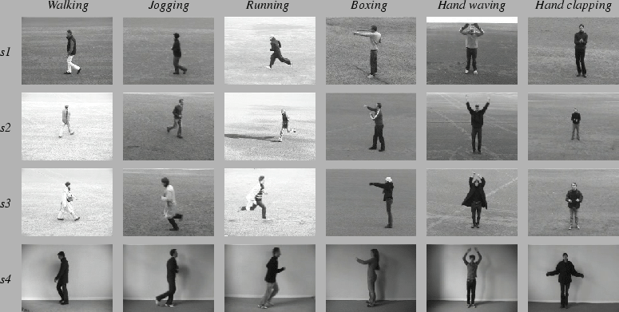

# Recognition of human actions in video

Download dataset at: http://www.nada.kth.se/cvap/actions/

The dataset contains 6 types of human actions:
- boxing, 
- hand clapping 
- hand waving,
- jogging, 
- running, 
- walking

performed several times by 25 subjects in four different scenarios: outdoors s1, outdoors with scale variation s2, outdoors with different clothes s3 and indoors s4 as illustrated below.

This repo implements a 3D convolutional net for video human activtity classification
