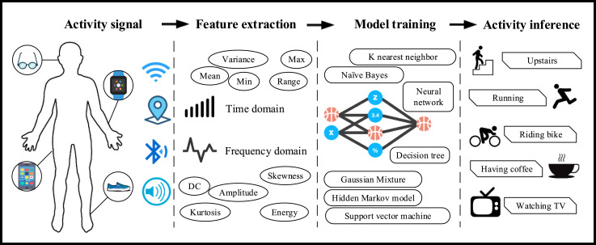

# Deep learning and applications

This repo contains implementation of some DL models for human acitivities classification in multi modal data (time series and video)

Images taken from: Jindong Wang et al, <em>Deep learning for sensor-based activity recognition: A Survey</em>, <strong>Pattern Recognition Letters (2018)</strong>, https://doi.org/10.1016/j.patrec.2018.02.010
